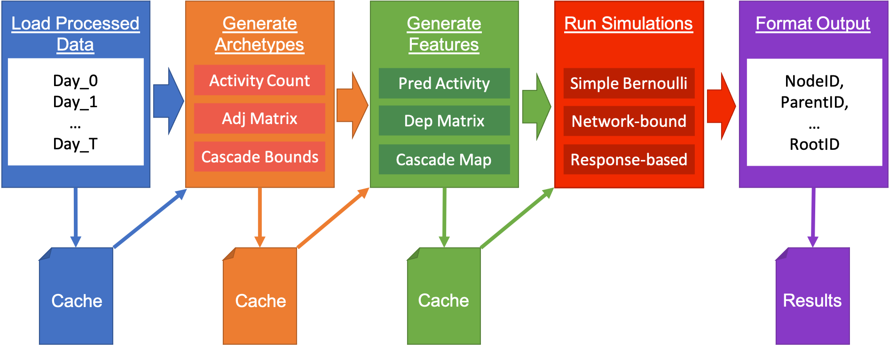

## Overview

**AMALIA** stands for **A**daptive **M**odular **A**pplication framework for **L**arge network simulations and **I**nformation **A**nalysis. Lite edition `v.1.0.0`.

## Initial Setup

After git cloning the project, in the working directory call

```bash
pip install -e amalia
mkdir output
```

To test the initial pipeline, simply run

```bash
python test.py
```

To run the AMALIA pipeline with a custom configuration file, run

```bash
python test.py <PATH_TO_SIM_CONFIG_FILE>
```



## General Design

AMALIA is built using the architecture illustrated above. Data is loaded through the DataFrame and formatted using a standardized schema. From there the data is passed to the Achertypes module, which identifies and transforms fundamental patterns and representations (e.g. user-specific time series) within the data that can easily be utilized in the Features module. The Features module takes some set of archetypes and extracts features that can be implemented in a simulation (e.g. user-specific ARIMA time series predictions for some window). These features are loaded into the Simulation module, which utilizes these features in some defined environment to generate events (e.g. Agent-based simulation). These events are passed to the Output module which reformats the results into the required output form. Finally, there is a global tool module which provides utilities to all other modules. These utilities include caching and a MapReduce function.

AMALIA follows a top-down dependency flow, which means the required features are explicitly determined by the simulation, and the required archetypes are determined by the features in use. This simplifies user control over running simulations, ensuring that the majority of the dependencies are handled in-simulation, with the user having to define only the simulation type, data sources, and whatever module parameters exist. Archetypes and features are designed to be generalizable and resuable, in a many-to-one dependency mapping at every stage of AMALIA (i.e. every feature can depend on multiple archetypes, and every simulation can depend on multiple features).

Below are the descriptions of each module in AMALIA, explaining how they work and how to build additions.

### The Configuration File

There is only one interface between the user and the simulations built within AMALIA: the config file. 

After importing AMALIA, the user need only provide a path to a config file in order to run all available simulations. The config file is of YAML form, with a primary form of:

```yaml
include: default.yaml
sim_type: SimlationType
data_loader:
  PrimaryPlatform: primary_data.csv
limits:
  start_date: '2018-01-01 00:00:00'
  end_date: '2018-04-01 23:59:59'
```

The `sim_type` is one of the two primary parameters, indicating the simulation that will run. Again, given AMALIA's top-down dependency flow, the archetypes and features will be called independently by the simulation upon runtime. All currently available simulations can be found in `amalia/simulation/SimulationFactory.py`.

The `data_loader` is the other primary parameter, pointing to the data set paths that will be used in the simulations. The `data_loader` parameter is embedded YAML, where the key is the name of the data set (usually the platform, like Twitter or YouTube), and the value is the actual path.

Any primary data set that is loaded in can have an arbitrary key (it is recommended this key identify the platform this data set belongs to, like `Twitter`), but the value must be pointed to a CSV file of the form `nodeID,nodeUserID,parentID,rootID,actionType,nodeTime`. See `data/example.csv` for an example of a primary dataset.

JSON files can also be loaded in as primary data through the `data_loader`. For example:

```yaml
data_loader:
  PrimaryPlatform: primary_data.csv
  JsonData: path_to_json_data.json
```

The DataFrame module will automatically isolate this JSON data for retrieval. This is usually useful for mapping information to specific nodes, such as 

```json
{
    "nodeID_1": ["list", "of", "information"]
}
```

Simulation-specific details (such as simulation start time, simulation end time, etc) should be kept in the embedded YAML of `limits`. These parameters can be called from anywhere in the AMALIA architecture. 

The `include` specifies the defaults for all parameters for all available features, archetypes, simulations, tools, and more. 

When a new feature, archetype, or simulation is added, whatever new parameters should be added to the default config file in the form:

```yaml
example_archetype:
  example_archetype_parameter: 987
```

Any parameters defined within `example_archetype` should only be called within the archetype called ExampleArchetype.

A table outlining all current options available for the configuration file can be found below.

| Path                                        | type                                   | Description                                                                                                                                                                                       | Default                                                           |
|---------------------------------------------|----------------------------------------|---------------------------------------------------------------------------------------------------------------------------------------------------------------------------------------------------|-------------------------------------------------------------------|
| cache_path                                  | str                                    | Folder to store cached results in.                                                                                                                                                                | `./.cache/`                                                       |
| dask.local_directory                        | str                                    | The path that Dask worker info will be stored in                                                                                                                                                  | "default"                                                         |
| dask.memory_limit                           | str                                    | Maximum bytes of memory any one Dask worker should use                                                                                                                                            | "8GB"                                                             |
| dask.n_workers                              | int                                    | Number Dask workers to use for Map Reduce                                                                                                                                                         |                                                                   |
| data_loader                                 | dict                                   | Dictionary of `{platform_name: path_to_data.csv}`                                                                                                                                                 |                                                                   |
| debug.trim_rows                             | int                                    | Limit to n rows of input data to reduce compute time for testing. If not specified does not do any trimming                                                                                       | `None`                                                            |
| enable_cache                                | bool                                   | Use caching system                                                                                                                                                                                | true                                                              |
| limits.end_date                             | iso8601 string                         | Time to stop the simulation                                                                                                                                                                       |                                                                   |
| limits.start_date                           | iso8601 string                         | Time to start the simulation                                                                                                                                                                      |                                                                   |
| limits.time_delta                           | pandas Timedelta string                | Specify the maximum resolution for discreet archetypes and features. For example "1d"                                                                                                             |                                                                   |
| output.destination                          | Path                                   | The directory in which to place the output                                                                                                                                                        |                                                                   |
| output.header.identifier                    | str                                    | The name of the model, used to prefix the identifier in the header, as well as determine file names for the output.                                                                               |                                                                   |
| output.id_sep                               | str                                    | String used to separate multiple information ids when concatenated to one string                                                                                                                  | $$$                                                               |
| output.include_config_hash                  | bool                                   | Include a summary hash of the entire config (all includes) in the header                                                                                                                          | true                                                              |
| output.include_git_hash                     | bool                                   | Include the hash of the most resent commit in the AMAILIA git repository                                                                                                                          | false                                                             |
| output.lines                                | bool                                   | Write the output as newline delimited JSON instead of a large JSON array                                                                                                                          | true                                                              |
| output.write_config                         | bool                                   | Include the config file when writing output                                                                                                                                                       | true                                                              |
| response_type_archetype.response_types      | { platform:[action_type] }             | Tells the response type which action types are considered responses. Is a dictionary where keys are the platform names, and values are lists of strings containing action types                   |                                                                   |
| sim_type                                    | str                                    | Name of the simulation type to use                                                                                                                                                                |                                                                   |
| time_series_archetype.base_actions          | { platform: action_type}               | Tell the time_series_archetype what action types are considered base actions. Is a dictionary where the keys are platforms and the values are action_types                                        |                                                                   |
| poisson_simulation.generate_replies | bool                                   | Generate replies using simple cascade model.                                                                                                                                                      | true
| parallel_poisson_simulation.generate_replies | bool                                   | Generate replies using simple cascade model.                                                                                                                                                      | true                                                              |
| parallel_poisson_simulation.nodes_per_thread | int                                    | Number of baseline nodes to be equally distributed to Dask workers during Map Reduce                                                                                                              | 100                                                                  |
| use_last_cache                              | bool                                   | Use the cache from the last run. Only enable if you have long-running upstream Features and Archetypes that don't change between runs.                                                            | false                                                             |


### The Achetype Module

The distinction between archetypes and featues is a bit vague. However, the general consensus is that an archetype represents the most basic transformations of the raw data loaded from the data sets. For example, given a data set, an archetype would be the transformation of that data set into user-specific, baseline-only time series representations. A feature would be a step up from that transformation, generating something from that transformation that would be directly used in the simulation. For example, given user-specific, baseline-only time series representations, a feature would be an ARIMA model that predicts future baseline events that would actually be fed into the simulation. The primary reasoning behind the division between archetypes and features is the utilization of the caching utility. The more steps between data loading and simulation, the more steps that can be cached, which is extremely beneficial to runtime regardless of tweaking between runs.

To generate a new archetype, follow the form

```python
import logging

logger = logging.getLogger(__name__.split('.')[-1])

class ExampleArchetype:
    '''

    Include a general overview of your example archetype here.

    Parameters
    ----------

    example_archetype_parameter : int (default : 123)
        Include a detailed explanation of your parameters here.

    Output
    ------

    Include a detailed explanation of the output here.

    Notes
    -----

    Add notes here.
    
    '''

    def __init__(self, cfg):
        self.example_archetype_parameter = cfg.get('example_archetype.example_archetype_parameter', default=123)
        self.cfg = cfg

    def compute(self, dfs):
        logger.info('Example archetype running here.')
        data = dfs.get_df('PrimaryPlatform')
        return data
```

This should be saved in `amalia/archetypes/`.

Each archetype is represented by a class, where the two required class methods is `__init__(self, cfg)` and `compute(self, dfs)`. It is important to note that `cfg` must be passed through all initialization functions, and `dfs` must be passed through all compute functions. `cfg` calls the ConfigHandler module, which interfaces with the user-provided config file, which can be seen as it calls the `example_parameter` parameter, with a default specified if the call fails. Parameters are handled directly by the ConfigHandler, and should be invariant of the dependency flow of AMALIA (i.e. don't pass parameters down from simulation, to feature to archetype; instead call the required parameter directly from the ConfigHandler at whatever stage it is required). Refer to `amalia/tools/ConfigHandler.py` for available functionality.

`dfs` calls the DataFrame module, which interfaces with the data sets loaded in at runtime. An example is presented when the data variable is defined, calling the `PrimaryPlatform` data set mentioned in previous section. The function `get_df()` returns a Pandas DataFrame (if the key being called points to a CSV file) or a dictionary (if the key being called points to a JSON file). Refer to `amalia/dataframe/DataFrame.py` for available functionality.

Logging is required for every module in AMALIA. Ensure to include a message at the top of the archetype compute function. Make sure to keep log ordering in mind in the following features and simulation.

Whatever is returned by the compute function is passed forward to any Feature modules that call this specific archetype.

### The Feature Module

The Feature module takes some set of dependent archetypes and extracts a less-generalized representation of the data that can be used directly in a simulation as a feature. Any computation-heavy processes that are specific to some individual component of the simulation (like predicting baseline event time series or assembling a user-response graph) should be done here.

To generate a new feature, follow the form

```python
import logging

logger = logging.getLogger(__name__.split('.')[-1])

from archetypes.ExampleArchetype import ExampleArchetype

class ExampleFeature:
    '''

    Include a general overview of your example feature here.

    Parameters
    ----------

    example_feature_parameter : int (default : 321)
        Include a detailed explanation of your parameters here.

    Output
    ------

    Include a detailed explanation of the output here.

    Notes
    -----

    Add notes here.
    
    '''

    def __init__(self, cfg):
        self.example_feature_parameter = cfg.get('example_feature.example_feature_parameter', default=321)
        self.cfg = cfg

    def compute(self, dfs):
        data = ExampleArchetype(self.cfg).compute(dfs) # Call archetype first
        logger.info('Example feature running here.') # Report log after archetype has successfully run
        return data
```

This should be saved in `amalia/features/`.

Note how this feature depends on the ExampleArchetype discussed in the previous section. To call the functionality of this archetype, import it and then call `compute()`, passing `dfs` through the compute function and passing `cfg` through as an initialization parameter. After the feature has computed upon the required archetypes, return the results in compute to pass them forward to a simulation.

### The Simulation Module

The simulation pulls multiple features and utilizes them iteratively in order to generate events of the output schema: `nodeID,nodeUserID,parentID,rootID,actionType,nodeTime,platform`. Event generation of this form should happen explicitly within the simulation stage.

To generate a new simulation, follow the form:

```python
import logging

logger = logging.getLogger(__name__.split('.')[-1])

from features.ExampleFeature import ExampleFeature
from features.SecondExampleFeature import SecondExampleFeature

class ExampleSimulation:
    '''

    Include a general overview of your example simulation here.

    Parameters
    ----------

    start_date : datetime 
        Begin date of the example simulation

    end_date : datetime
        End date of the example simulation

    Output
    ------

    Include a detailed explanation of the output here.

    Notes
    -----

    Add notes here.
    
    '''

    def __init__(self, cfg):
        self.start_date = cfg.get("limits.start_date", type=convert_date)
        self.end_date = cfg.get("limits.end_date", type=convert_date)
        self.cfg = cfg

    def compute(self, dfs):
        a = ExampleFeature(self.cfg).compute(dfs)
        b = SecondExampleFeature(self.cfg).compute(dfs)
        logger.info('Example feature running here.') # Report log after all features have successfully run

        results = []
        for c in (a + b):
            results.append({'nodeID': 'a', 'nodeUserID': 'b', 
                        'parentID': 'c','rootID': 'd', 'actionType': 'e', 
                        'nodeTime': 'f', 'informationID': 'g', 
                        'platform': 'PrimaryPlatform', 'has_URL': 0, 
                        'links_to_external': 0})

        return results
```

A list of dictionaries following this format should be returned at the end of the compute function. This will be passed to the OutputWriter module which will reformat it and save it.

In order to be able to call this simulation from a config file, this simulation must be loaded into the SimulationFactory. This can be done by editing the `get_simulation_map()` function from within `amalia/simulation/SimulationFactory.py`:

```python
def get_simulation_map():
    from simulation.ExampleSimulation import ExampleSimulation

    return {
        'ExampleSimulation': ExampleSimulation
    }
```

Calling `"sim_type": "ExampleSimulation"` in the config file at runtime will trigger the ExampleSimulation and all of its cascading dependencies.

## Tools

Currently there are four primary tools available that can be accessed across all stages of AMALIA:

1. Caching
2. MapReduce
3. Utilities
4. Report Generator

These tools primarily exist to speed up and enhance computation, as well as standardize common methods between modules.

### Caching

Caching is represented by a decorator that stores the results of a function to disk. If that same cached function is stored to disk without any change in parameters, the cached result is pulled up in its place, saving computation time by skipping the contained processes altogether. To use caching, run:

```python
import tools.Cache as Cache

@Cache.amalia_cache
def compute(self, dfs):
    # insert functionality here...
    return data
```

By adding the decorator to the compute function, the content of data as it is returned will be cached. The styling of AMALIA dictates that the caching decorator should only be applied to the compute function of archetype, fucntion, and simulation modules.

### MapReduce

It is recommended that for the majority of computations within AMALIA, using numpy compute-over-array is the best method. However, in the event a for loop over independent elements is required, MapReduce can be used. In order to enable MapReduce, within the config file the `dask` key must be added to include

```yaml
dask:
  n_workers: 2
  memory_limit: 8GB
  local_directory: default
```

When `n_workers` is greater than 1, Dask is enabled, with worker info stored at the `local_directory` path. Increasing the number of workers increases the number of available Dask workers that can run partitions of the data that will be scattered. Ensure that the partition map is tuned to accomondate the number of available workers.

To use MapReduce run:

```python
# Required for MapReduce functionality
from dask import delayed
from tools.MapReduce import map_reduce, reduce_list, partition_nodes

def compute(self, dfs): # public function
    # Get the list of unique nodes for the specified platform from the DataFrame module
    node_map = dfs.get_node_map('PrimaryPlatform')

    # Partition all indepdendent elements into bins (partition map)
    # Each Dask worker will recieve one bin and run only the ids within that bin
    nodes = partition_nodes(len(independent_data), nodes_per_thread)

    # Define kwargs to scatter and pass to worker function
    scatter_data_kwargs = {'data_to_scatter': independent_data}
    map_function_kwargs = {'parameters_to_pass_to_map_function': 123}

    # Run MapReduce
    results = map_reduce(nodes, # map specifying what elements in independent_data are run for each worker
                    delayed(_map_function), # map function
                    delayed(reduce_list), # reduce function
                    scatter_data_kwargs=scatter_data_kwargs, # data to scatter to worker function
                    map_function_kwargs=map_function_kwargs).compute() # parameters to pass to map function

    return results

def _map_function(nodes, data_to_scatter, parameters_to_pass_to_map_function): 
    # First use the worker's specific partition to pull only the data alloted to this specific worker
    worker_partition_of_data = data_to_scatter[nodes]
    # Functionality to run on the partition of independent_data as specified by nodes...
    return things
```

First a list of binned nodes (the partition map) must be generated to associated partitions of the scattered data to each Dask worker. This can be done through `partition_nodes()`. The variable representing the partition map should be the first parameter in the map function and be used to pull only the partition's associated allotment of data that has been scattered. After this, the data that will be scattered to the map functions must be specified in `scatter_data_kwargs`. These parameters will be the second proceeding parameters in the map function. Next define `map_function_kwargs`, the parameters to pass directly to each map function. These parameters will be the final proceeding parameters in the map function. 

After all of these components have been specified, implement them in the `map_reduce()` function, and then call `.compute()`. To view the progress each map and reduce function is making as the workers run through the partition data, visit http://localhost:8787/status.

### Utilities

The utilities code contains any functionality that is consistently used across archetypes, features, and simulations. 

### Report Generator

The report generator can be used to compare the output of a simulation with ground truth, initialization data, or other simulation output. However, unlike previous utilities, this tool is separate from the rest of the AMALIA pipeline, and is controlled using a different configuration file that inherits from the simulation configuration file. Calling this report configuration file from `compare.py <PATH_TO_REPORT_CONFIG_FILE>` will generate an HTML report that can be opened in any standard web browser. The content of the generated report varies depending on the type of report functionality that in called within the report configuration file. See `config/compare.yaml` for an example on how the report configuration file should be set up. The required functionality is packaged within report classes found in `amalia/reports/`. 

Following are instructions on how to write a report configuration file, followed by instructions on how to generate new report classes for additional functionality.

#### Writing a report config file
1) The most elementary report config file contains three elements: an output specification, the config files to compare, and the types of reports to generate
2) The output specification is just a path to an html file
placed under `output` in config file.
3) In order for the report to be useful, you must be able to compare the results of multiple simulations. To do this, write a simulation config file for each parameter set you want to compare, this can simply change tuning parameters, or use entirely different simulation types. Once these are writen, place there paths in an array called `configs` in your comparison config file. (_n.b._ These paths are relative to your current directory, not the compare.yaml file. ) The output for these config files is automatically  generated by the reporting system, and is written using the output settings specified by each config file.
4) Next you must specify which types of reports to generate. Place the class names in an array called `reports`.
5) Run your report config file by calling it with `compare.py`

#### Plotting initialization data
Initialization data can be plotted by adding a path to it using the key `source`. This data should be in the same form as the simulator outputs. The data can be cropped using `source_limits.start_date` and `source_limits.end_date` and `source_limits.end_date`. This data is feed into each report class just like your simulation
results.

#### Creating a new Report

1) Create a new python file in the `amalia/reports` directory. For example `ExampleReport.py`
2) Create a class in that file with the exact same name
	```python	
	class ExampleReport:
	```
3) This class's `__init__` should take a `ConfigHandler` and Dictionary of configName:DataFame.
	```python
    def __init__(self, cfg: ConfigHandler, results: Dict[str, pd.DataFrame]):
        super().__init__(cfg, results)
	```
4) The class should have a `write` method that takes a `ReportWriter` as an argument
	```python	
    def write(self, report: ReportWriter):
	```
5) Call methods on this object.
	- `section` creates a heading with optional level
	- `p` creates a paragraph of text
	- `table` writes a pandas dataframe as an html table
	- `savefig` places the current `matplotlib` figure as an embedded image
6) Place the name of the class under `reports` in your report config file (see `compare.yaml` for an example) and run this file.

## Style Guide

Refer to https://www.python.org/dev/peps/pep-0008 for tips on adhering to the overall design style of AMALIA.

## Acknowledgements

A huge thank you goes out to [Omar Malik](https://github.com/omarkmalik), [Fred Buchanan](https://github.com/Boscillator), and [Sam Cohen](https://github.com/EldritchCrow), who helped design multiple aspects of AMALIA's codebase and helped implement some of its functionality.
